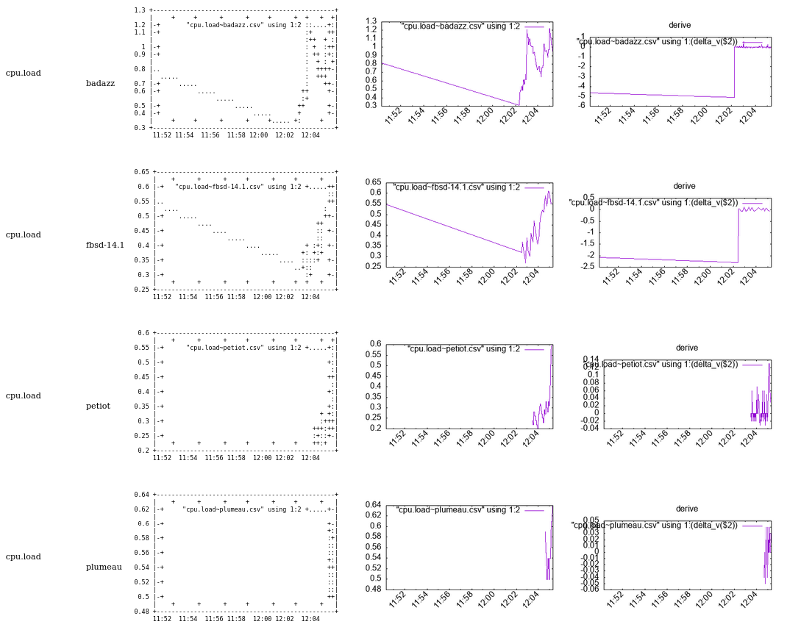

Intro
=====

This project is an implementation of such a way of thinking distributed system.
For sake of education I took the most compact language for the task : *bash*

We are gonne realize on this principle a Fast Adaptative Insecure Monitoring system.

FAIM is designed as a funny experiment of doing a munin clone (doing less) in bash only that is specialized in high speed (~1 seconde / measure) distributed measuring system without a centralized collector.

No broker, no Zmq, no webrtc, no QUIC, no rabbitMQ are used for transport but ... BROADCAST UDP.

Hence, well, this toy is fondamentally insecure and can hardly be ciphered in its current form.  But, it enables a category of software that are both educational for doing your own tool AND 
for deploying an adhoc measuring system.

