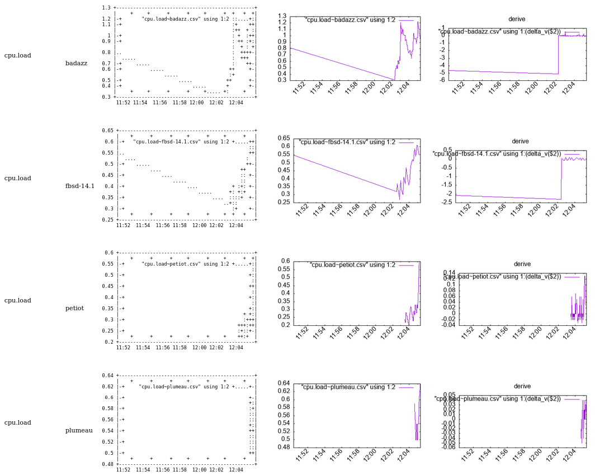

# Intro

This project is an implementation of such a way of thinking distributed system.
For sake of education I took the most compact language for the task : *bash*

We are gonne realize on this principle a Fast Adaptative Insecure Monitoring system.

FAIM is designed as a funny experiment of doing a munin clone (doing less) in bash only that is specialized in high speed (~1 seconde / measure) distributed measuring system without a centralized collector.

No broker, no Zmq, no webrtc, no QUIC, no rabbitMQ are used for transport but ... BROADCAST UDP.

Hence, well, this toy is fondamentally insecure and can hardly be ciphered in its current form.  But, it enables a category of software that are both educational for doing your own tool AND 
for deploying an adhoc measuring system.

[Read full documentation here](https://github.com/jul/FAIM/tree/main/doc)

# Mort de FAIM?

It's funny in french, because it means starving.

But actually, I really don't like the insecure part of this, so as a demontrator
I have tried [mqtt](https://en.wikipedia.org/wiki/MQTT) as a bus and even though
it removes the beauty of no broker, it has proven easy and fun to use.

However, I commited a python proof of concept which defeat the concept of *all
in bash*. I will wait for [curl to fully support
mqtt(s)](https://curl.se/docs/mqtt.html).

Right now, mqtt is incompletly supported by curl, but I will integrate it when it will be
ready under the nickname FASM (Fast Adaptative Secure Monitoring).

The PoC with all security turned on is [here for the pub
part](https://github.com/jul/FAIM/blob/main/bin/mqtt_pub.py),
[here for the sub part](https://github.com/jul/FAIM/blob/main/bin/mqtt_sub.py).

NB: I could hack a version with  mosquitto\_pub and mosquitto\_sub

